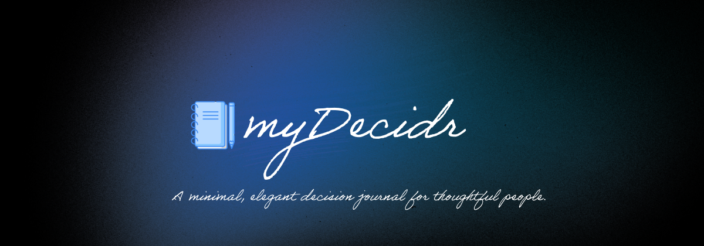

<div align="center">



<br/>
<br/>

[](https://my-decidr.vercel.app/)
&nbsp;
[](#)
&nbsp;
[](#)

<br/>

*A quiet space to record your decisions, your reasoning, and how they turned out.*

</div>

---

## Overview

Most people forget why they made a decision within weeks. Decidr fixes that.

It's a personal decision journal — log what you decided, why you decided it, and how confident you felt. Then come back later and record what actually happened. Over time, you build a clear picture of how you think and where your judgment is strong or weak.

No accounts. No cloud. No tracking. Everything lives on your device.

---

## Features

- **Decision Logging** — Capture the full context: situation, options considered, the choice made, and your reasoning at the time
- **Confidence Tracking** — Tag each decision as Low, Medium, or High confidence
- **Outcome Reviews** — Revisit past decisions and record how they actually played out
- **Insights Dashboard** — Review rates, average outcome scores, most common categories, and outcome distributions
- **Category Filters** — Organize across Career, Finance, Health, Relationships, Personal, and more
- **Review Reminders** — Pulsing badges highlight decisions that are due for a look back
- **Mobile-First** — Designed for one hand. Feels native on iOS and Android. Works offline
- **Fully Private** — All data is stored locally in your browser. Nothing leaves your device

---

## Design

Decidr draws from editorial and journal aesthetics — serif headlines, deep dark surfaces, and a single indigo accent — to feel more like a personal notebook than a productivity app.

| Token | Value |
|---|---|
| Background | `#0a0a0f` |
| Surface | `#12121a` |
| Accent | `#6366f1` |
| Headline font | Cormorant Garamond |
| UI font | Outfit |

Full design reference in [`docs/DESIGN.md`](docs/DESIGN.md).

---

## Tech

A single HTML file. No frameworks, no bundler, no build step, no backend.

| | |
|---|---|
| Language | Vanilla HTML / CSS / JS |
| Storage | `localStorage` — fully offline |
| Dependencies | None |
| Bundle size | One file |

---

## Project Structure

```
decidr/
├── index.html              # The entire application
├── assets/
│   ├── logo.png            # App logo
│   └── banner.png          # Banner image
├── docs/
│   ├── DESIGN.md           # Visual language & design decisions
│   └── ROADMAP.md          # Planned features
├── CHANGELOG.md            # Version history
├── .gitignore
└── README.md
```

---

## Deployment

Decidr is a static file — it deploys anywhere in seconds.

### Vercel (recommended)
1. Import the repo at [vercel.com/new](https://vercel.com/new)
2. Framework preset: **Other**
3. Click **Deploy**

### Netlify
Drag and drop the project folder at [netlify.com/drop](https://app.netlify.com/drop). Done.

### Any static host
Upload `index.html` to any web server or CDN. That's all that's needed.

---

## Roadmap

See [`docs/ROADMAP.md`](docs/ROADMAP.md) for the full list. Near-term:

- [ ] Export decisions as JSON or PDF
- [ ] Full-text search
- [ ] Spaced repetition review scheduling
- [ ] Optional cloud sync
- [ ] Light theme

---

## License

Private repository. Not licensed for public use or redistribution.

---

<div align="center">

[Open Decidr →](https://my-decidr.vercel.app/)

</div>
